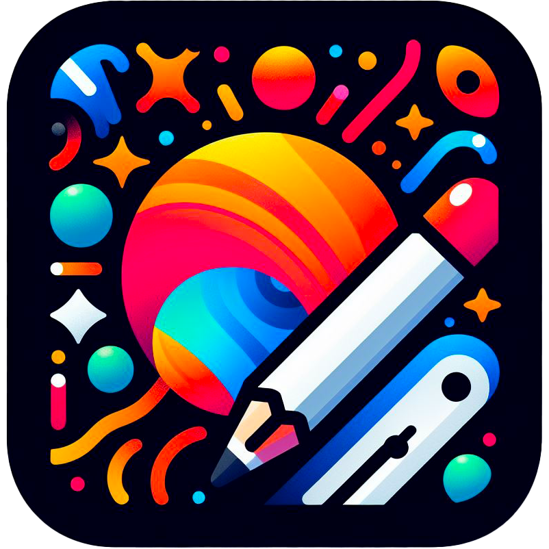
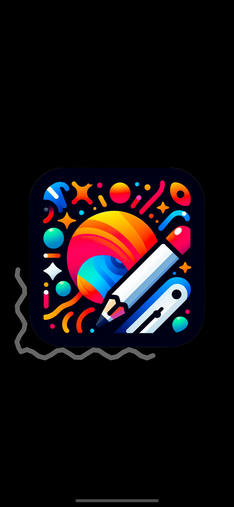
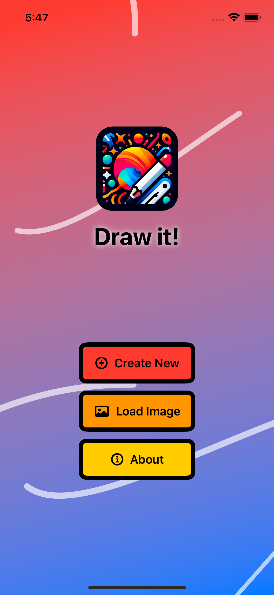
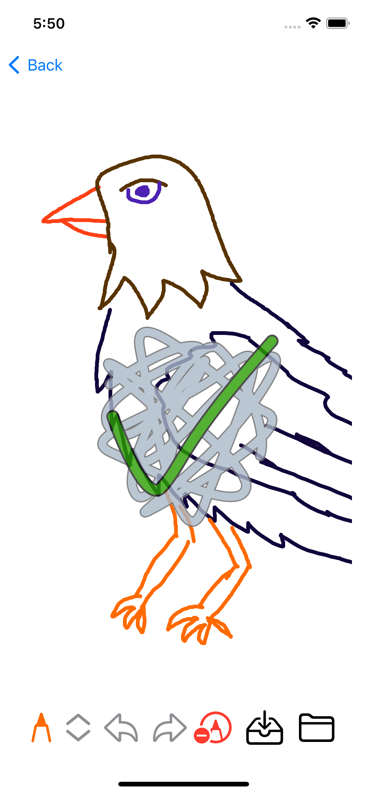
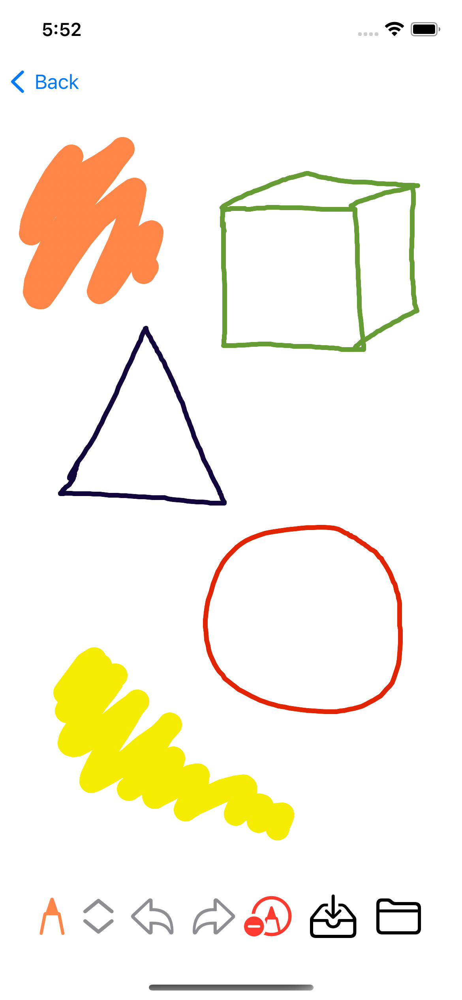
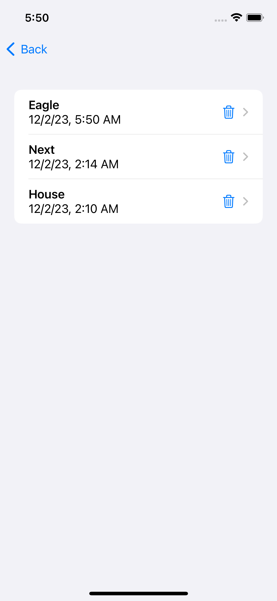

  
  <h1>Draw it!</h1>
  

    
    
    
  

Draw It! is a simple drawing application developed in Swift using SwiftUI. The app provides users to draw simple pictures using a pencil tool. This application was developed as a semester project at the UTB FAI university in the subject focused on the development of iOS applications.

## Spash screen & main menu

Before the application is loaded, a splash screen is displayed and then the user is taken to the main menu. For more interesting disign there is a dynamically rendered background. The background randomly draws bars that resemble hand drawing. 

    
    

## Drawing area

The app has a simple workspace. At the bottom of the view are there all necessary tools. For drawing is here color picker and pencil size selector. Next is here undo and redo action and image clear button. Last buttons are here saving the image to the local database using CoreData and finally exporting the image to the gallery.

    
    

## Image storage

When user goes to the load image section, a list of all the images stored in the persistent memory of the application is displayed here. The user can edit any image or delete it.

